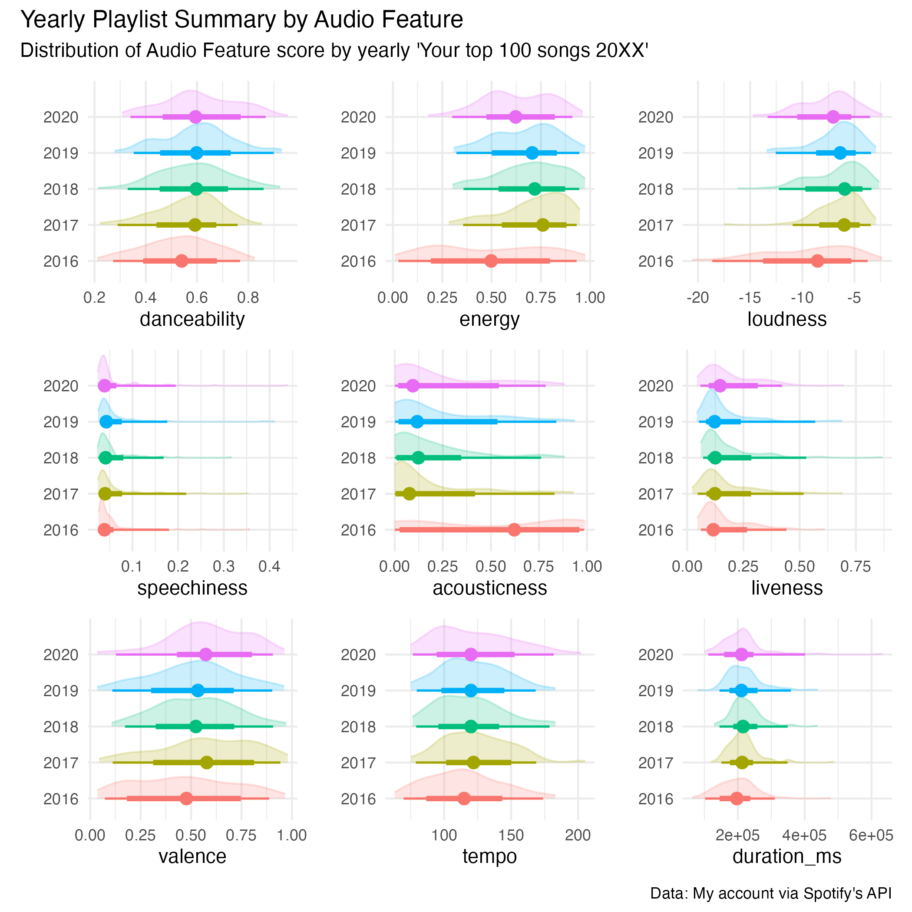
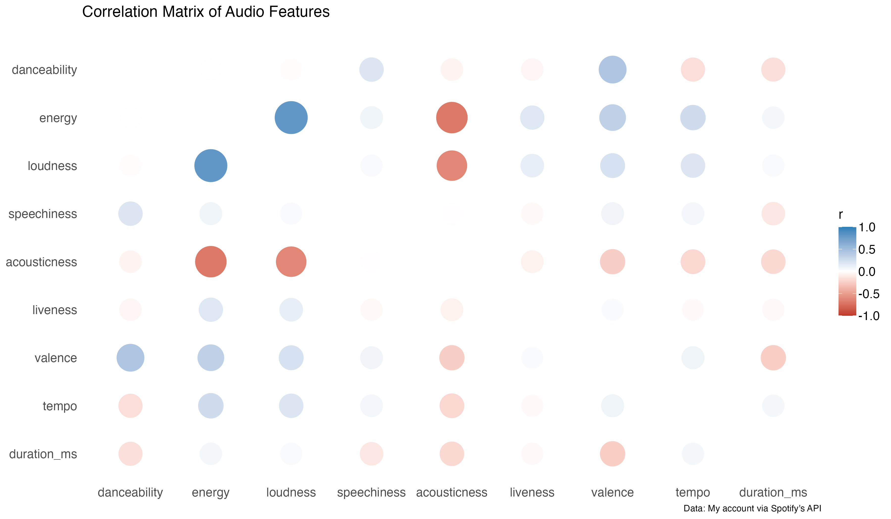
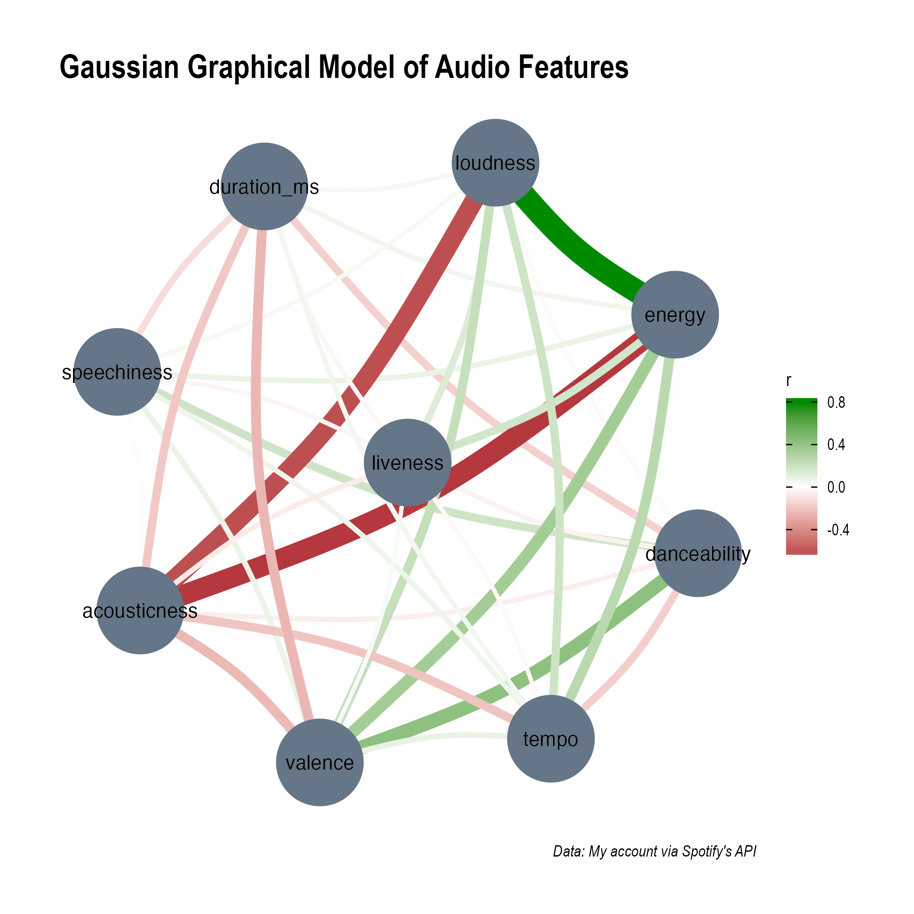

# Spotify Top 100 Yearly Playlist Analysis

# Wesley, Why?
Every year Spotify comes out with our top 100 songs. Since I've been using Spotify from some time now, I have a couple playlists built up. I always wondered how my music taste has changed throughout the year. Wielding Spotify's API and being able to accesss different [Audio Features](https://benanne.github.io/2014/08/05/spotify-cnns.html) I thought it might be worth checking out. 

# Spotify's Audio Features:

From [The Spotify API Documentation](https://developer.spotify.com/documentation/web-api/reference/#objects-index) we get a description of the different features.

 - `acousticness` - A confidence measure from 0.0 to 1.0 of whether the track is acoustic.
 - `danceability` - Danceability describes how suitable a track is for dancing based on a combination of musical elements including tempo, rhythm stability, beat strength, and overall regularity. A value of 0.0 is least danceable and 1.0 is most danceable.
 - `duration_ms` - The duration of the track in milliseconds.
 - `energy` - Energy is a measure from 0.0 to 1.0 and represents a perceptual measure of intensity and activity. 
 - `instrulmentalness` - Predicts whether a track contains no vocals.
 - `liveness` - Detects the presence of an audience in the recording. 
 - `loudness` - The overall loudness of a track in decibels (dB).
 - `speechiness` - Speechiness detects the presence of spoken words in a track. 
 - `tempo` - The overall estimated tempo of a track in beats per minute (BPM)
 - `valence` - A measure from 0.0 to 1.0 describing the musical positiveness conveyed by a track.

# What I found:

I was able to get a really cool look at the different scores over the years. It's neat to see how my taste has changed.

## Summary of each feature by year
Below are the distributions of each feature by year of playlist:

## Correlation of Variables

Thanks to the `correlation` package I'm also able to dive into the correlation between features:
### Correlation Matrix

### Gaussian Graphical Model of Audio Features

